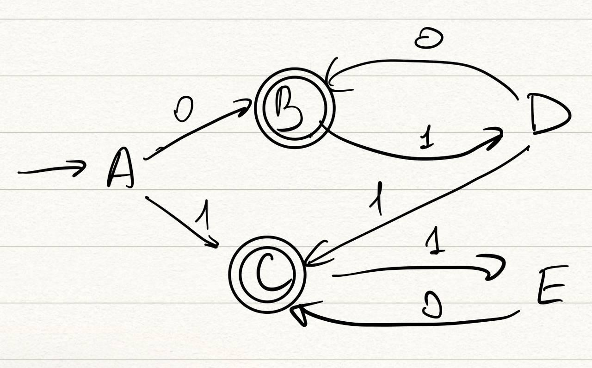

# HW03

## Ответы, как и в прошлый раз, в файле `answer.md`

1. (2 балла) Минимизировать автомат без и с добавленным стоковым состоянием, проверить, есть ли разница.

   

2. (2 балла) Предложить конкретный синтаксис описания конечных автоматов. Описание синтаксиса должно быть подробным, но человекочитаемым. Стоит указать вид лексем, используемых в языке; возможность использовать пробельные и специальные символы; какие есть синтаксические категории, и как они связаны. Привести примеры конечных автоматов на этом языке.

3. (4 балла) Реализовать синтаксический анализатор для предложенного конкретного синтаксиса.

   * Задание должно быть оформлено как консольное приложение, принимающее как аргумент командной строки путь ко входному файлу. Результат синтаксического анализа должен быть записан в файл с тем же именем, но добавочным расширением `.out` (если вход -- `input.txt`, то результат работы записать в `input.txt.out`).

   * Для представления результата синтаксического анализа создать подходящую структуру данных. Должно быть возможно получить алфавит, множество состояний, стартовое состояние, множество терминальных состояний и отношение перехода. Эту структуру данных в случае успешного анализа распечатать в `.out` файл.

   * Можно использовать любой язык программирования.

   * Желательно использовать метод рекурсивного спуска.

   * Код должен быть сопровожден инструкцией по сборке и запуску, протестирован.

[Запись пары](https://drive.google.com/file/d/1aKDjMdYePfqCJ0iJn6XdvHOyWmtYPQgu/view?usp=sharing)
