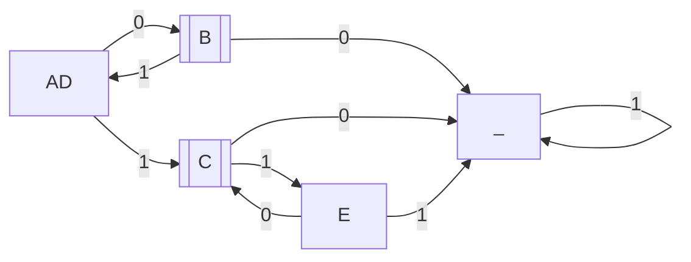
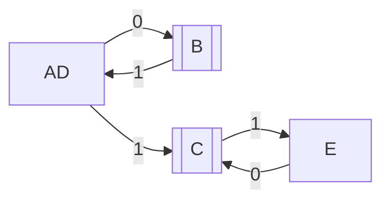

1. 
Cо стоковым состоянием
|   | A | B | C | D | E | _
| - | - | - | - | - | - | -
| A | V | - | - | - | - | -
| B | x | V | - | - | - | -
| C | x | x | V | - | - | -
| D | V | x | x | V | - | -
| E | x | x | x | x | V | -
| _ | x | x | x | x | x | V

Без стокового состояния

|   | A | B | C | D | E
| - | - | - | - | - | -
| A | V | - | - | - | -
| B | x | V | - | - | -
| C | x | x | V | - | -
| D | V | x | x | V | -
| E | x | x | x | x | V

