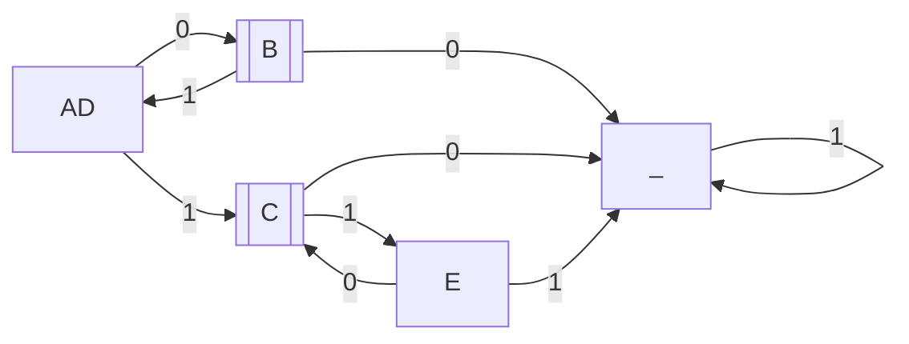
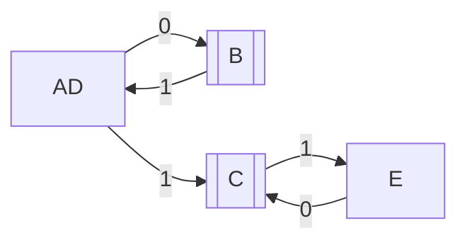

1. 
Cо стоковым состоянием
|   | A | B | C | D | E | _
| - | - | - | - | - | - | -
| A | V | - | - | - | - | -
| B | x | V | - | - | - | -
| C | x | x | V | - | - | -
| D | V | x | x | V | - | -
| E | x | x | x | x | V | -
| _ | x | x | x | x | x | V

Без стокового состояния

|   | A | B | C | D | E
| - | - | - | - | - | -
| A | V | - | - | - | -
| B | x | V | - | - | -
| C | x | x | V | - | -
| D | V | x | x | V | -
| E | x | x | x | x | V

В обеих случаях результат получился одинаковый.
A и D в любом случае сливаются, т.к. они приходят в одинаковые состояния
по последовательностям длины один. А для всех остальных пар находится
последовательность (длины один или два), по которой из одного состояния
можно попасть в терминал, а из другого нельзя выйти

2. Для описания автоматов будем использовать подмножество JSON.
Автомат описывается JSON объектом c полями:
    - `alphabet` -- массив строк или натуральных чисел
    - `states` -- массив строк или натуральных чисел
    - `terminals` -- массив строк или натуральных чисел, подмножество `states`
    - `start` -- Строка или число, элемент `states`
    - `sigma` -- Массив объектов с полями
        - `from` -- Строка или натуральное число, элемент `states`
        - `to` -- Строка или натуральное число, элемент `states`
        - `by` -- Строка или натуральное число, элемент `alphabet`

    В качестве примера в файле `finite-automata-parser/example.json`
    находится описание автомата из первого задания

3. Решение задания три находится в папке `finite-automata-parser`
